<div align="center">

```
  ____                  _    _       _
 |  _ \  ___  ___ _ __ / \  | |_ __ | |__   __ _
 | | | |/ _ \/ _ \ '_ \ _ \ | | '_ \| '_ \ / _` |
 | |_| |  __/  __/ |_) | | || | |_) | | | | (_| |
 |____/ \___|\___| .__/|_|_||_| .__/|_| |_|\__,_|
                 |_|          |_|
            F R E Q A I   P L U G I N
```

# Turn Freqtrade into a quant-grade ML trading machine.

[](https://pypi.org/project/deepalpha-freqai/)
[](https://pypi.org/project/deepalpha-freqai/)
[](https://www.python.org/downloads/)
[](https://opensource.org/licenses/MIT)
[](https://www.freqtrade.io/en/stable/freqai/)
[](https://github.com/stefanoviana/deepalpha)
[](https://discord.gg/P4yX686m)

**A drop-in FreqAI model that replaces the default pipeline with institutional-grade ML techniques**
_Triple Barrier Labeling. SHAP feature selection. Meta-labeling. Purged walk-forward CV. Regime-aware barriers. Sequential memory features. LightGBM._

[**Install**](#install-in-10-seconds) - [**Quick Start**](#quick-start-in-60-seconds) - [**Honest numbers**](#honest-backtest-numbers-v110) - [**How it works**](#what-is-inside) - [**Docs**](./examples) - [**Website**](https://deepalphabot.com) - [**Discord**](https://discord.gg/P4yX686m)

</div>

---

## Why DeepAlpha?

Stock FreqAI trains a regressor on raw future returns. That is a textbook approach that **leaks, overfits, and ignores regime shifts**. DeepAlpha replaces it with techniques used by quantitative hedge funds, codified by Marcos Lopez de Prado in *Advances in Financial Machine Learning*.

### Standard FreqAI vs. DeepAlpha

| | Standard FreqAI | DeepAlpha 1.1 |
|---|---|---|
| Labeling | Fixed-horizon return | **Regime-aware Triple Barrier** |
| Feature selection | All features, always | **SHAP top-k**, auto-refresh |
| Temporal context | None (point-in-time features) | **Sequential memory** (rolling stats, z-scores, lags) |
| Signal filter | Threshold on raw output | **Meta-labeling** + **hard regime gate** |
| Position sizing | Fixed stake | **Dynamic** (scales 0.25x-1.75x with confidence) |
| Validation | k-fold or holdout | **Purged Walk-Forward CV** |
| Overfitting control | Manual | Embargo + purge gaps |
| Backend | Mixed (LGB/XGB/sklearn) | **LightGBM 3-class** (tuned) |

---

## Install in 10 seconds

```bash
pip install deepalpha-freqai
```

That is it. No cloning, no symlinks, no copy-paste. The plugin registers `DeepAlphaModel` for FreqAI automatically.

---

## Quick start in 60 seconds

**1. Copy the reference strategy** (or download [`example_strategy.py`](./example_strategy.py)):

```bash
wget https://raw.githubusercontent.com/stefanoviana/deepalpha/main/freqai-plugin/example_strategy.py \
     -O user_data/strategies/DeepAlphaStrategy.py
```

**2. Use the reference config** ([`config_example.json`](./config_example.json)). The critical bits:

```jsonc
{
  "timeframe": "1h",
  "freqai": {
    "enabled": true,
    "model_type": "DeepAlphaModel",
    "train_period_days": 90,
    "backtest_period_days": 21,
    "feature_parameters": {
      "include_timeframes": ["1h", "4h"],
      "indicator_periods_candles": [10, 20, 50],
      "label_period_candles": 12,
      "include_shifted_candles": 3
    },
    "deepalpha": {
      "triple_barrier":         { "profit_taking": 1.5, "stop_loss": 1.5, "max_holding_period": 12 },
      "shap_feature_selection": { "enabled": true, "top_k": 30 },
      "meta_labeling":          { "enabled": true, "threshold": 0.55 },
      "purged_cv":              { "n_splits": 5, "purge_gap": 24, "embargo_pct": 0.01 }
    }
  }
}
```

**3. Download data and backtest:**

```bash
freqtrade download-data --config config.json \
  --timerange 20240101-20240401 \
  --timeframes 1h 4h --trading-mode futures

freqtrade backtesting --config config.json \
  --strategy DeepAlphaStrategy \
  --freqaimodel DeepAlphaModel \
  --timerange 20240125-20240325
```

That is it. DeepAlpha handles labels, feature engineering, meta-filtering, regime gating and position sizing for you.

Prefer to use the primitives standalone (without FreqAI)? See [examples/demo.py](./examples/demo.py) - 50 lines, no Freqtrade required.

---

## Honest backtest numbers (v1.1.0)

These are the numbers we got on our own machine. Binance Futures, 5 majors (BTC/ETH/SOL/BNB/XRP), 1h bars, 90-day rolling training, 21-day forward tests, 3 open trades max, $1,000 starting wallet. **Your mileage will vary. Do your own backtest before trusting it with money.**

| Regime | Period | Market change | Bot profit | Win rate | Max DD | Sharpe |
|---|---|---|---|---|---|---|
| 🟢 **Bull** | Jan 25 - Mar 25 2024 | +67.66% | **+6.93%** | 62.5% | **2.37%** | **5.98** |
| 🔴 **Bear** (LUNA crash) | May 4 - Aug 15 2022 | -33.60% | **+0.41%** | 58.0% | 7.74% | 0.21 |

**What these numbers say:**
- Makes money in bull with a **5.98 Sharpe** and a **2.37% max drawdown** (!)
- **Survives a bear market -33% with positive PnL** (most crypto bots die here)
- Long / short trades are roughly balanced (63/73 in the bull test, 116/258 in bear)
- Beats a buy-and-hold on a risk-adjusted basis, not on absolute return

**What these numbers do NOT say:**
- They are not forward-tested live yet
- They are 2 pairs and 2 regimes - not a proof of universality
- Past performance is never future performance

See [`CHANGELOG.md`](./CHANGELOG.md) for the full v1.1.0 methodology and breaking changes from v1.0.x.

---

## Architecture

```mermaid
flowchart LR
    A[OHLCV + Indicators<br/>+ Sequential features] --> B[Regime-Aware<br/>Triple Barrier]
    B --> C[Primary LGBM<br/>3-class, full features]
    C --> D[SHAP Feature<br/>Selection top-k]
    D --> E[Primary LGBM<br/>pruned, 3-class]
    E --> F[Meta-Labeling<br/>LGBM filter]
    F --> G[Purged<br/>Walk-Forward CV]
    G --> H[Hard Regime<br/>Entry Gate]
    H --> I[Dynamic Position<br/>Sizing]
    I --> J[Trading<br/>Signal]
    style B fill:#ff6b6b,color:#fff
    style D fill:#4ecdc4,color:#fff
    style F fill:#ffe66d,color:#000
    style G fill:#a8e6cf,color:#000
    style H fill:#ffa8a8,color:#000
    style I fill:#b8a0ff,color:#000
```



Every training run executes all seven stages. Every prediction is filtered by the meta-model, gated by the regime filter, and sized by confidence.

---

## What is inside

### 1. Regime-Aware Triple Barrier Labeling
Every candle is labelled by which of three barriers is hit first - profit target, stop loss, or time expiry. **Barriers scale asymmetrically by regime** (EMA24 vs EMA96):
- **Bull**: profit 1.2σ, stop 2.0σ (favour longs, tolerate pullbacks)
- **Bear**: profit 2.0σ, stop 1.2σ (favour shorts, tolerate bounces)
- **Sideways**: 1.5 / 1.5 (symmetric)

This fixes the structural bias where naive Triple Barrier over-labels SHORT in volatile bull markets.

### 2. Sequential Memory Features (poor-man's LSTM)
The model sees temporal context without a recurrent network. For each bar we compute:
- Rolling log-return mean/std/sum/skew over 4/12/24/48 bars
- Return z-score vs 24-bar std (how extreme is the current move)
- Volatility-of-volatility (regime-change signal)
- Close and volume lag features (1/3/6/12 bars)
- High-Low range-ratio

Result: ~70% of an LSTM's edge at 10% of the complexity.

### 3. SHAP Feature Selection
After the first pass, SHAP values rank every feature by real contribution. The model is retrained using only the top-k. Refreshed every N trainings to follow regime drift.

### 4. Meta-Labeling
A second LightGBM learns *when the primary model is likely right*. Trades only fire when meta-confidence exceeds threshold. Improves precision at the cost of recall.

### 5. Hard Regime Gate
No counter-trend trades, ever. Longs only in uptrend, shorts only in downtrend (EMA24 vs EMA96 on the trading timeframe). This alone turned us from -11% to +7% on the 2024 bull test.

### 6. Dynamic Position Sizing
`custom_stake_amount()` scales the stake linearly with `P_max`, the winning-class probability:
- `P = 0.55` (just above gate) → 0.5x stake
- `P = 0.80+` → 1.5x stake

High-confidence signals get more capital, marginal calls get less.

### 7. Purged Walk-Forward CV
Time-series CV with purge gaps and embargo periods. Kills lookahead bias. Honest out-of-sample diagnostics every fold.

### 8. 3-class LightGBM Backend
Gradient boosting tuned for financial noise. Multi-class (SHORT=0, FLAT=1, LONG=2) with `class_weight="balanced"`. GPU-ready. Deterministic (`random_state=42`).

---

## When to use this

**Use DeepAlpha if you...**
- Already use FreqAI and want better science under the hood
- Want labels that reflect actual trading outcomes, not arbitrary horizons
- Suffer from models that look great in CV and die live (lookahead bias)
- Run portfolios of 5-20 assets on the 1h-4h scale
- Care about calibrated signals and risk-adjusted returns, not just hit rate

**DO NOT use this if you...**
- Trade manually and want discretion
- Have less than 6 months of OHLCV history per pair
- Run extremely high-frequency (sub-minute) strategies - this is hourly scale
- Refuse to read logs and adjust hyperparameters
- Expect 100x returns with no drawdown

---

## Examples

See [`./examples/`](./examples):

- [`demo.py`](./examples/demo.py) - 50-line standalone demo. Synthetic data → Triple Barrier → LGBM → predictions. No Freqtrade required.
- [`quickstart.ipynb`](./examples/quickstart.ipynb) - Jupyter walkthrough with visualisations, SHAP plots, and a toy backtest.
- [`config_example.json`](./config_example.json) - Full FreqAI config with DeepAlpha block (1h bars).
- [`example_strategy.py`](./example_strategy.py) - Reference Freqtrade strategy with all v1.1 features.

---

## Roadmap

- [x] v1.0.0 - Initial release
- [x] v1.0.5 - Production-stable predict() schema
- [x] **v1.1.0 - Profitable on bull + bear backtests (current)**
- [ ] v1.2 - **Ensemble mode** (LGBM + XGBoost + CatBoost stacking)
- [ ] v1.3 - **HMM regime detection** as a hard prior
- [ ] v1.4 - **LSTM / Transformer** option as primary model
- [ ] v1.5 - **Fractional differentiation** for feature stationarity (de Prado Ch. 5)
- [ ] v2.0 - **Official FreqAI upstream** submission

Vote on features on [Discord](https://discord.gg/P4yX686m).

---

## The bigger picture

This plugin is extracted from **DeepAlpha**, a production trading system running the same pipeline live across crypto perps. If you want the full stack - automated training, multi-exchange execution, risk manager, vault - visit [**deepalphabot.com**](https://deepalphabot.com).

The open-source plugin exists because we believe the science should be free. The edge is in the execution.

---

## Community

- **Website**: [deepalphabot.com](https://deepalphabot.com)
- **Discord**: [Join here](https://discord.gg/P4yX686m) - quant chat, strategy tuning, free support
- **GitHub**: [stefanoviana/deepalpha](https://github.com/stefanoviana/deepalpha)
- **Issues / bugs**: [Open a ticket](https://github.com/stefanoviana/deepalpha/issues)

---

## Contributing

PRs welcome. Please:
1. Fork and branch from `main`
2. Add tests under `./tests/` (we use pytest)
3. Keep PEP-8, add type hints, run `pytest -v`
4. Open a PR with a clear description and backtest evidence if applicable

Want to upstream DeepAlpha into Freqtrade core? We are actively working on this - join Discord and help us get to v2.0.

---

## License

MIT. Use it, fork it, ship it. Attribution appreciated but not required.

---

## Acknowledgments

This plugin stands on the shoulders of:

- **Marcos Lopez de Prado** - *Advances in Financial Machine Learning* (Wiley, 2018). Triple Barrier, Meta-Labeling, Purged CV, Fractional Differentiation. Essential reading.
- **Ernest Chan** - *Machine Trading* and *Quantitative Trading*. The rigor and the scars.
- **Lundberg & Lee** - SHAP: A Unified Approach to Interpreting Model Predictions (NeurIPS 2017).
- **The Freqtrade team** - for building FreqAI and keeping it open.

If this plugin makes you money, buy their books first.

---

<div align="center">

**Built by traders, for traders.**

If DeepAlpha helps you, star the repo and tell a friend.

[](https://github.com/stefanoviana/deepalpha)

</div>
